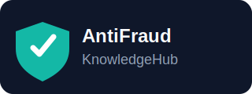
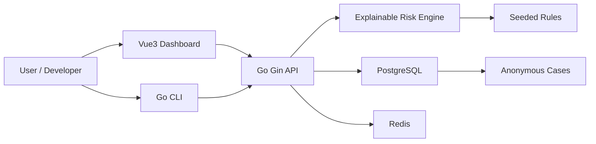

# AntiFraud-KnowledgeHub

> AntiFraud-KnowledgeHub is an open-source knowledge base and explainable risk analysis toolkit for identifying online fraud patterns in Chinese-speaking scenarios.



[](#)
[](LICENSE)
[](#)

AntiFraud-KnowledgeHub 是一个面向中文互联网场景的反诈骗知识库与可解释风险识别平台。项目第一版聚焦可运行 MVP：结构化诈骗分类、规则引擎、匿名案例库、文本风险分析 API、Vue3 控制台和开发者 CLI。

## Why

在线诈骗话术变化快，但很多风险信号仍然可解释、可审计、可由社区维护。本项目希望提供一个 public-interest anti-fraud 工具，让开发者、研究者和公益团队可以基于开放规则库构建自己的风险提示能力。

## MVP Scope

- Scam categories for investment fraud, cashback task fraud, fake customer service, phishing links, AI deepfake fraud and more.
- Explainable risk rules with keyword, regex, pattern and mock semantic providers.
- Text analysis API returning score, level, matched rules, evidence and recommendations.
- Anonymous sample scam cases for local demos and tests.
- Vue3 dashboard for overview, text analysis, rules, cases, categories and docs.
- Docker Compose startup for PostgreSQL, Redis, backend and frontend.

## Quick Start

```bash
cp .env.example .env
make dev
```

Backend health check:

```bash
curl http://localhost:8080/api/v1/health
```

Text analysis:

```bash
curl -X POST http://localhost:8080/api/v1/analysis/text \
  -H "Content-Type: application/json" \
  -d '{"text":"客服说账户异常，需要转账到安全账户"}'
```

Frontend: http://localhost:5173

API docs: http://localhost:8080/swagger/index.html

## Local Development

```bash
make backend-test
make frontend-build
make seed
```

CLI:

```bash
cd backend
go run ./cmd/afkh-cli analyze --text "客服说账户异常，需要转账到安全账户"
```

## Tech Stack

- Backend: Go, Gin, GORM, PostgreSQL, Redis, Zap, Viper, swaggo/gin-swagger
- Frontend: Vue 3, TypeScript, Vite, Element Plus, Pinia, Vue Router, Axios, ECharts, UnoCSS
- DevOps: Docker Compose, Makefile, GitHub Actions

## Architecture



## Data Model

- Category: scam category metadata and default severity.
- RiskRule: explainable keyword, regex, pattern or semantic placeholder rules.
- ScamCase: anonymized case samples with tags and risk points.
- AnalysisRecord: input text, score, level, matched rules and recommendations.

## Roadmap

- v0.1 MVP: rules, cases, API, dashboard, Docker.
- v0.2 Community Rules: contribution workflow and review helpers.
- v0.3 AI-assisted analysis adapter: optional external provider interface.
- v0.4 Browser extension.
- v0.5 Multi-language support.

## Screenshots

See [docs/screenshots.md](docs/screenshots.md) for placeholders.

## Documentation

- [Architecture](docs/architecture.md)
- [API](docs/api.md)
- [Data schema](docs/data-schema.md)
- [Risk engine](docs/risk-engine.md)
- [Roadmap](docs/roadmap.md)

## Contributing

This is an early-stage open-source project seeking community contributions. See [CONTRIBUTING.md](CONTRIBUTING.md) for rule, category and anonymized case contribution guidelines.

## License

MIT. See [LICENSE](LICENSE).
