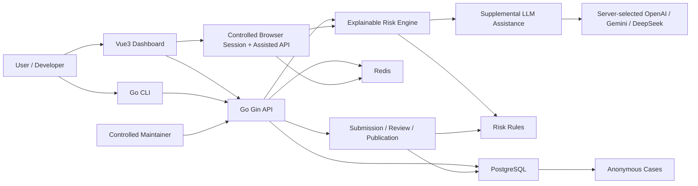
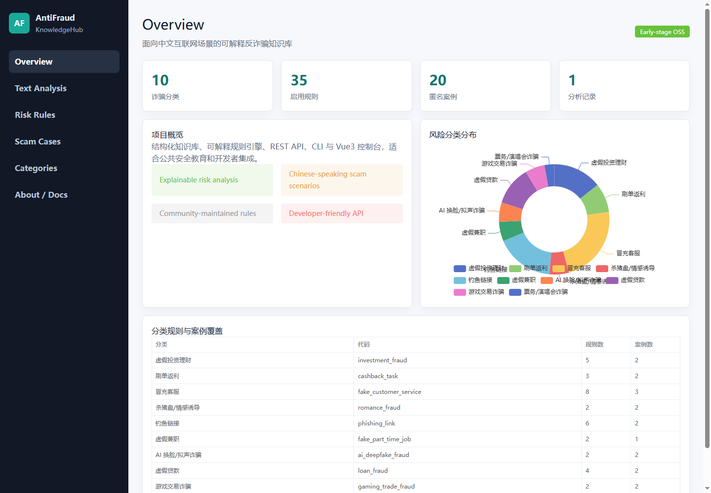
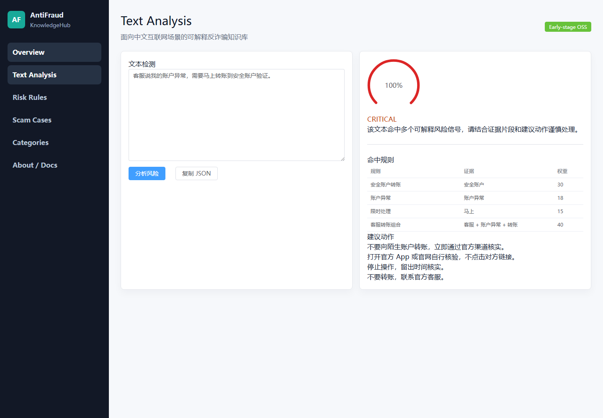

# AntiFraud-KnowledgeHub

> Project status: Early-stage MVP. The project is public, runnable locally, and actively maintained. Community contributions for anti-fraud rules, anonymized cases, documentation, and integrations are welcome.

> AntiFraud-KnowledgeHub is an open-source knowledge base and explainable risk analysis toolkit for identifying online fraud patterns in Chinese-speaking scenarios.

[](https://github.com/qiuweiyu/antifraud-knowledgehub/actions/workflows/ci.yml)
[](LICENSE)
[](#)

AntiFraud-KnowledgeHub 是一个面向中文互联网场景的反诈骗知识库与可解释风险识别平台。项目聚焦可运行、可审计的基础能力：结构化诈骗分类、规则引擎、匿名案例库、文本风险分析 API、Vue3 控制台、开发者 CLI、默认关闭的受控规则提交→人工审核→发布工作流，以及同样默认关闭、保持规则引擎权威性的可选 AI 辅助分析。

AntiFraud-KnowledgeHub is an anti-fraud knowledge base and explainable risk analysis platform designed for Chinese-speaking online scenarios. The project focuses on runnable and auditable foundations: structured scam categories, a rule engine, an anonymized case library, a text risk analysis API, a Vue3 dashboard, a developer CLI, a default-off independently authorized rule submission -> human review -> publication workflow, and optional default-off AI-assisted analysis that keeps deterministic rule results authoritative.

## Why

在线诈骗话术变化快，但很多风险信号仍然可解释、可审计、可由社区维护。本项目希望提供一个 public-interest anti-fraud 工具，让开发者、研究者和公益团队可以基于开放规则库构建自己的风险提示能力。

Online fraud tactics evolve quickly, but many risk signals are still explainable, auditable, and maintainable by the community. This project aims to provide a public-interest anti-fraud toolkit that enables developers, researchers, educators, and non-profit teams to build their own risk warning capabilities based on an open rule library.

## Current Scope

- Scam categories for investment fraud, cashback task fraud, fake customer service, phishing links, AI deepfake fraud and more.
- Explainable risk rules with keyword, regex, pattern and mock semantic providers.
- Text analysis API returning score, level, matched rules, evidence and recommendations.
- Anonymous sample scam cases for local demos and tests.
- Vue3 dashboard for overview, text analysis, rules, cases, categories and docs.
- Docker Compose startup for PostgreSQL, Redis, backend and frontend.
- Rule draft validation before persistence.
- Default-off controlled pending submission, human approve/reject review, publication audit and approved-only rule publication.
- Replay-safe/idempotent workflow behavior with PostgreSQL-backed concurrency tests.
- Optional multi-provider LLM assistance for OpenAI, Gemini and DeepSeek behind server-owned provider/model/credential configuration.
- Explicit deterministic-first assisted-analysis transports with Redis abuse/cost controls, bounded input/output and no automatic provider retry.
- Controlled browser assisted-analysis bridge using operator-provisioned access grants, opaque HttpOnly Redis sessions, exact-Origin/CSRF checks, per-principal/global cost admission and server-approved profiles.
- Vue assisted-analysis UX that requires explicit opt-in and displays the server-provided third-party transfer disclosure next to the action; rule-engine results remain the primary result.

The controlled rule workflow is a maintainer transport, not anonymous public write access. Submission, review and publication use independent credentials; review/publication actor labels are server-owned operational attribution rather than user identity or OAuth/RBAC.

AI assistance is also controlled and optional. The deterministic risk engine remains the sole authority for risk score, risk level, matched rules, evidence and rule-derived recommendations. LLM output is supplemental only and must not be treated as a definitive fraud verdict, rule approval authority or substitute for independent official-channel verification.

## Quick Start

Docker Compose starts PostgreSQL, Redis, the Go API and the Vue dashboard:

```bash
cp .env.example .env
make dev
```

Backend health check:

```bash
curl http://localhost:8080/api/v1/health
```

Text analysis:

```bash
curl -X POST http://localhost:8080/api/v1/analysis/text \
  -H "Content-Type: application/json" \
  -d '{"text":"客服说账户异常，需要转账到安全账户"}'
```

Frontend: http://localhost:5173

API docs: http://localhost:8080/swagger/index.html

The controlled rule mutation routes and AI-assisted routes remain disabled unless their explicit feature flags, credentials and protection settings are configured. Normal `/analysis/text` and `/analysis/preview` stay deterministic-only even when an LLM provider is configured. See [Community Rule Workflow](docs/community-rule-workflow.md), [API](docs/api.md), [LLM Assisted Analysis Design](docs/llm-assisted-analysis-design.md) and [Authenticated Browser Assisted Analysis Design](docs/authenticated-browser-assisted-analysis-design.md) before enabling controlled transports.

## Local Development

For local backend development without Docker, SQLite is supported as a
lightweight database driver:

```bash
cd backend
DATABASE_DRIVER=sqlite DATABASE_DSN=afkh-dev.db go run ./cmd/server
```

Then start the frontend in another terminal:

```bash
cd frontend
npm install
npm run dev
```

```bash
make backend-test
make frontend-build
make seed
```

CLI:

```bash
cd backend
go run ./cmd/afkh-cli analyze --text "客服说账户异常，需要转账到安全账户"
```

## Tech Stack

- Backend: Go, Gin, GORM, PostgreSQL, Redis, Zap, Viper, swaggo/gin-swagger
- Frontend: Vue 3, TypeScript, Vite, Element Plus, Pinia, Vue Router, Axios, ECharts, UnoCSS
- DevOps: Docker Compose, Makefile, GitHub Actions

## Architecture


```mermaid
flowchart LR
  User["User / Developer"] --> Frontend["Vue3 Dashboard"]
  User --> CLI["Go CLI"]
  Frontend --> API["Go Gin API"]
  CLI --> API
  API --> Engine["Explainable Risk Engine"]
  API --> DB["PostgreSQL"]
  API --> Redis["Redis"]
  Engine --> Rules["Risk Rules"]
  DB --> Cases["Anonymous Cases"]
  Maintainer["Controlled Maintainer"] --> API
  API --> Workflow["Submission / Review / Publication"]
  Workflow --> DB
  Workflow --> Rules
  Frontend --> BrowserBridge["Controlled Browser Session + Assisted API"]
  BrowserBridge --> Engine
  BrowserBridge --> Redis
  Engine --> LLMAssist["Supplemental LLM Assistance"]
  LLMAssist --> Provider["Server-selected OpenAI / Gemini / DeepSeek"]
```

The LLM path is explicit and optional: deterministic analysis runs first, then exactly one server-approved assistance provider may be called. Provider failure does not replace or suppress the deterministic result.

## Data Model

- Category: scam category metadata and default severity.
- RiskRule: explainable keyword, regex, pattern or semantic placeholder rules.
- ScamCase: anonymized case samples with tags and risk points.
- AnalysisRecord: input text, score, level, matched rules and recommendations.
- RuleSubmission: non-executable pending/terminal proposal snapshot, separate from the risk engine.
- RuleSubmissionReviewEvent: terminal human-review audit event.
- RuleSubmissionPublicationEvent: approved-source publication provenance linking the submission/review to the initially published rule identity.

Publication/review events provide application audit provenance; the project does not claim a cryptographically immutable ledger. Assisted-analysis requests do not introduce an LLM prompt/response history model and the controlled assisted routes create no new `AnalysisRecord` rows.

## Roadmap

Current `main` contains the controlled community-rule workflow foundation: contribution format, validation, pending submission, human approve/reject review, publication, audit, idempotency and concurrency coverage.

The broader **v0.2 Community Rules** roadmap is not fully complete. Rule versioning/history and a per-rule changelog remain future work, along with any future design for broader contributor identity/permissions or maintainer UI.

The **v0.4 AI-assisted Adapter core** is delivered: provider-neutral assistance, OpenAI/Gemini/DeepSeek adapters, deterministic authority/fallback semantics, controlled assisted HTTP transport, authenticated browser bridge and explicit Vue opt-in/disclosure. A multi-profile Vue selector remains only an optional future enhancement if a deployment intentionally enables more than one server-approved profile.

Later roadmap areas include richer examples/documentation, browser-extension distribution/cross-browser work and multi-language support. See [ROADMAP.md](ROADMAP.md) for the current breakdown.

## Screenshots

Real screenshots captured from the runnable local MVP are available in
[docs/screenshots.md](docs/screenshots.md).




## Documentation

- [v0.1.4 security patch release candidate notes](docs/releases/v0.1.4.md)
- [v0.1.3 release notes source](docs/releases/v0.1.3.md)
- [Architecture](docs/architecture.md)
- [API](docs/api.md)
- [Data schema](docs/data-schema.md)
- [Risk engine](docs/risk-engine.md)
- [LLM assisted analysis design](docs/llm-assisted-analysis-design.md)
- [Multi-provider LLM design](docs/multi-provider-llm-design.md)
- [Assisted-analysis HTTP transport design](docs/assisted-analysis-http-transport-design.md)
- [Assisted-analysis profile selection design](docs/assisted-analysis-profile-selection-design.md)
- [Authenticated browser assisted-analysis design](docs/authenticated-browser-assisted-analysis-design.md)
- [Rule contribution format](docs/rule-contribution-format.md)
- [Community rule workflow](docs/community-rule-workflow.md)
- [Rule submission review and audit design](docs/rule-submission-review-audit-design.md)
- [Publication transport design](docs/rule-submission-publication-transport-design.md)
- [Roadmap](ROADMAP.md)

## Contributing

This is an early-stage open-source project seeking community contributions. See [CONTRIBUTING.md](CONTRIBUTING.md) for rule, category and anonymized case contribution guidelines. External contributors can continue using normal scoped pull requests; controlled bearer credentials are not required for ordinary community contribution.

## License

MIT. See [LICENSE](LICENSE).
