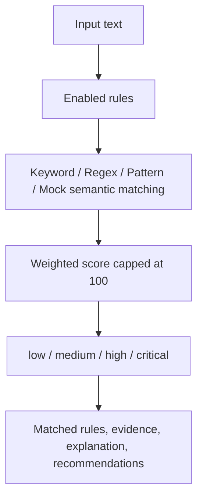

# Architecture

AntiFraud-KnowledgeHub is a compact monorepo with a Go API, Vue3 dashboard, shared seed data and developer examples.

## Backend

The backend is organized around modules:

- `category`: scam category CRUD.
- `rule`: risk rule CRUD and toggle.
- `caseitem`: anonymous scam case CRUD.
- `analysis`: text analysis API and analysis records.
- `health`: service health endpoint.
- `riskengine`: explainable matching, scoring and level calculation.
- `seed`: JSON seed import from the repository `data` directory.

## Frontend

The frontend uses Vue3 + TypeScript + Vite with API wrappers, typed models, router views, reusable components and global styles.

## Data Stores

PostgreSQL stores categories, rules, cases and analysis records. Redis is wired for local infrastructure readiness and can later support caching or rate-limit counters.

## Module Boundaries

Handlers are intentionally thin: they validate HTTP input and delegate matching to the `riskengine` package or persistence to GORM models. The first MVP avoids authentication, RBAC and microservices so the project remains easy to run locally and easy for contributors to understand.

## Risk Engine Flow

