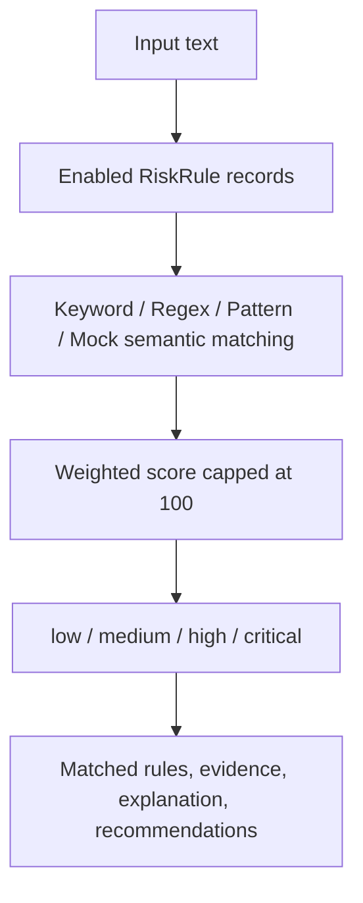

# Architecture

AntiFraud-KnowledgeHub is a compact monorepo with a Go API, Vue3 dashboard, shared seed data and developer examples.

## Backend

The backend is organized around modules:

- `category`: scam category CRUD.
- `rule`: risk rule CRUD/toggle, rule-draft validation, pending submission, human review and approved-only publication.
- `caseitem`: anonymous scam case CRUD.
- `analysis`: text analysis API and analysis records.
- `health`: service health endpoint.
- `riskengine`: explainable matching, scoring and level calculation.
- `seed`: JSON seed import from the repository `data` directory.
- `middleware`: CORS/request logging plus controlled submission/review/publication authorization and submission rate limiting.

## Frontend

The frontend uses Vue3 + TypeScript + Vite with API wrappers, typed models, router views, reusable components and global styles.

The current visible Rules UI supports rule management and draft validation. The controlled review/publication workflow is currently API/operator oriented; the project does not claim a full maintainer review dashboard.

## Data Stores

PostgreSQL is the persistence and concurrency authority for categories, rules, cases, analysis records and the controlled rule workflow.

The workflow keeps these concepts separate:

```text
RuleSubmission
  -> RuleSubmissionReviewEvent
  -> RuleSubmissionPublicationEvent
  -> RiskRule
```

A pending submission is not executable. Review approval does not itself create a `RiskRule`. Publication verifies approved provenance/current validation and atomically creates the initial rule plus publication event.

Redis is used by the controlled submission-write abuse-control path for per-credential and global rate limits. That limiter fails closed when its state cannot be evaluated. Review and publication do not currently add Redis-specific limiters; publication/review correctness remains enforced by PostgreSQL transactions and constraints.

## Security and Module Boundaries

Handlers remain intentionally thin: they enforce transport boundaries and delegate business mutation to the rule services or persistence layer.

The project still avoids a general account/authentication/RBAC subsystem, but it now has **narrow controlled Bearer authorization boundaries** for rule submission, review and publication. These are independent operational credentials, not user identity, OAuth or general RBAC.

Key boundaries include:

- all controlled mutation routes are disabled by default,
- submission, review and publication credentials are independent,
- review/publication actor labels are server-owned operational attribution,
- unreviewed submissions never enter the risk engine,
- AI is not a final rule-approval authority,
- PostgreSQL constraints/transactions are the concurrency authority for review/publication correctness,
- audit events are application provenance and are not described as a cryptographically immutable ledger.

See [Community Rule Workflow](community-rule-workflow.md) for the current lifecycle and [API](api.md) for transport details.

## Risk Engine Flow


```mermaid
flowchart TD
  Input["Input text"] --> Rules["Enabled RiskRule records"]
  Rules --> Match["Keyword / Regex / Pattern / Mock semantic matching"]
  Match --> Score["Weighted score capped at 100"]
  Score --> Level["low / medium / high / critical"]
  Level --> Output["Matched rules, evidence, explanation, recommendations"]
```

Controlled pending/review records do not participate in this flow until an approved submission is explicitly published into a `RiskRule`.
