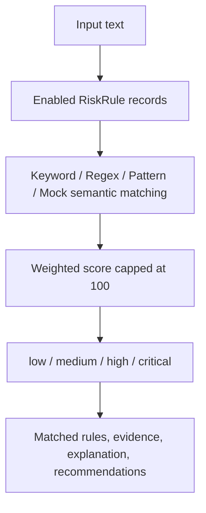

# Architecture

AntiFraud-KnowledgeHub is a compact monorepo with a Go API, Vue3 dashboard, shared seed data and developer examples.

## Backend

The backend is organized around modules:

- `category`: scam category CRUD.
- `rule`: risk rule CRUD/toggle, rule-draft validation, pending submission, human review and approved-only publication.
- `caseitem`: anonymous scam case CRUD.
- `analysis`: deterministic text analysis plus the explicit assisted-analysis response composition that keeps the rule result authoritative.
- `health`: service health endpoint.
- `riskengine`: explainable matching, scoring and level calculation; sole authority for risk score/level/matched-rule fields.
- `llmassist`: provider-neutral supplemental assistance service, bounded output validation, provider registry/profiles and OpenAI/Gemini/DeepSeek adapters.
- `browserauth`: digest-only Browser Access Grant registry, opaque Redis session handling, principal-generation revocation, exact-Origin/CSRF authorization and browser-assisted cost admission.
- `seed`: JSON seed import from the repository `data` directory.
- `middleware`: CORS/request logging plus controlled submission/review/publication authorization and maintainer assisted-analysis protections.

## Frontend

The frontend uses Vue3 + TypeScript + Vite with API wrappers, typed models, router views, reusable components and global styles.

The visible Analysis UI keeps deterministic rule output as the primary result. AI assistance is a separate optional section that requires a valid controlled browser session, an available server-approved profile, the server-provided third-party transfer disclosure and an explicit user opt-in before an assisted request is sent.

The current visible Rules UI supports rule management and draft validation. The controlled review/publication workflow is currently API/operator oriented; the project does not claim a full maintainer review dashboard.

## Data Stores

PostgreSQL is the persistence and concurrency authority for categories, rules, cases, analysis records and the controlled rule workflow.

The workflow keeps these concepts separate:

```text
RuleSubmission
  -> RuleSubmissionReviewEvent
  -> RuleSubmissionPublicationEvent
  -> RiskRule
```

A pending submission is not executable. Review approval does not itself create a `RiskRule`. Publication verifies approved provenance/current validation and atomically creates the initial rule plus publication event.

Redis is used for multiple narrow protection/state roles:

- controlled submission-write per-credential/global rate limiting;
- opaque browser sessions keyed by one-way session-token digests;
- pre-auth Browser Access Grant exchange source/global limiting;
- authenticated browser assisted-analysis per-principal/global cost admission;
- controlled maintainer assisted-analysis cost/rate admission.

These Redis protection paths fail closed when their state cannot be evaluated. Review and publication do not currently add Redis-specific limiters; publication/review correctness remains enforced by PostgreSQL transactions and constraints.

## Deterministic and Assisted Analysis Flow

Normal analysis remains deterministic-only:

```text
input text
  -> load enabled RiskRule rows
  -> riskengine.Engine.Analyze
  -> authoritative rule result
```

The explicit assisted path is additive and runs only after its access/cost boundary succeeds:

```text
explicit assisted request
  -> authorization / Origin / session / CSRF as applicable
  -> Redis cost admission
  -> strict bounded request + server-owned profile resolution
  -> load enabled RiskRule rows
  -> riskengine.Engine.Analyze
  -> authoritative rule result
  -> exactly one server-selected llmassist Service call
  -> supplemental assistance (available | unavailable)
```

Provider failure, timeout, malformed output or refusal does not replace the deterministic result and is not automatically retried. The provider cannot set or mutate authoritative risk fields.

## Browser Assisted Trust Boundary

The first browser bridge is a controlled beta boundary rather than anonymous public cost-bearing LLM access:

1. An operator provisions a high-entropy Browser Access Grant and stores only its SHA-256 digest in server configuration.
2. `POST /api/v1/browser/session/exchange` verifies exact Origin, rate admission and the grant, then creates an opaque one-hour Redis session and an HttpOnly cookie.
3. Session validation re-resolves the current principal and `principal_generation`, so disabling/removing the principal or incrementing generation revokes existing sessions.
4. JavaScript receives only non-secret principal/session metadata plus a derived CSRF token; the raw session token remains in the HttpOnly cookie.
5. `POST /api/v1/browser/analysis/assisted` requires exact Origin, valid current session, CSRF and per-principal/global Redis cost admission before analysis/provider work.
6. The browser sends only `{text, profile_id}`. Provider, model, API key, base URL, endpoint, tools, retry policy and output budgets remain server-owned.

The Browser Assisted API is same-origin by design. CORS is not treated as authentication.

## Security and Module Boundaries

Handlers remain intentionally thin: they enforce transport boundaries and delegate business mutation/analysis to bounded services or persistence layers.

The project still avoids a general account/authentication/RBAC subsystem, but it now has narrow controlled authorization boundaries for rule workflow operations and browser-assisted beta access. These are operational controls, not a claim of public user identity, OAuth or general RBAC.

Key boundaries include:

- all controlled mutation and cost-bearing assisted routes are disabled by default,
- submission, review and publication credentials are independent,
- provider API keys and maintainer assisted tokens remain server-side,
- Browser Access Grants are never persisted by the SPA and only grant digests are configured server-side,
- review/publication actor labels are server-owned operational attribution,
- unreviewed submissions never enter the risk engine,
- the deterministic risk engine owns score, level, matched rules, evidence and rule-derived recommendations,
- LLM assistance is supplemental and is not a final fraud verdict, rule-approval authority or enforcement authority,
- provider failure cannot destroy or rewrite a successfully computed deterministic result,
- normal `/analysis/text` and `/analysis/preview` never invoke an LLM provider,
- PostgreSQL constraints/transactions are the concurrency authority for review/publication correctness,
- audit events are application provenance and are not described as a cryptographically immutable ledger.

See [Community Rule Workflow](community-rule-workflow.md), [LLM Assisted Analysis Design](llm-assisted-analysis-design.md), [Authenticated Browser Assisted Analysis Design](authenticated-browser-assisted-analysis-design.md) and [API](api.md) for detailed lifecycle/transport contracts.

## Risk Engine Flow


```mermaid
flowchart TD
  Input["Input text"] --> Rules["Enabled RiskRule records"]
  Rules --> Match["Keyword / Regex / Pattern / Mock semantic matching"]
  Match --> Score["Weighted score capped at 100"]
  Score --> Level["low / medium / high / critical"]
  Level --> Output["Matched rules, evidence, explanation, recommendations"]
```

Controlled pending/review records do not participate in this flow until an approved submission is explicitly published into a `RiskRule`. LLM assistance also sits outside the scoring flow and cannot mutate these authoritative outputs.
