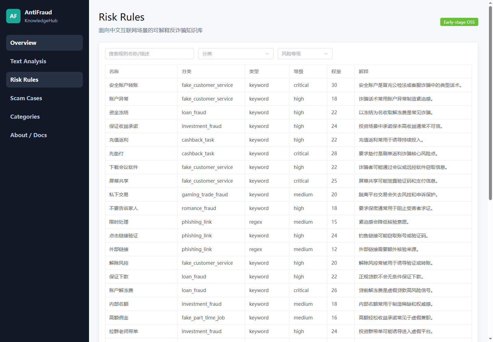
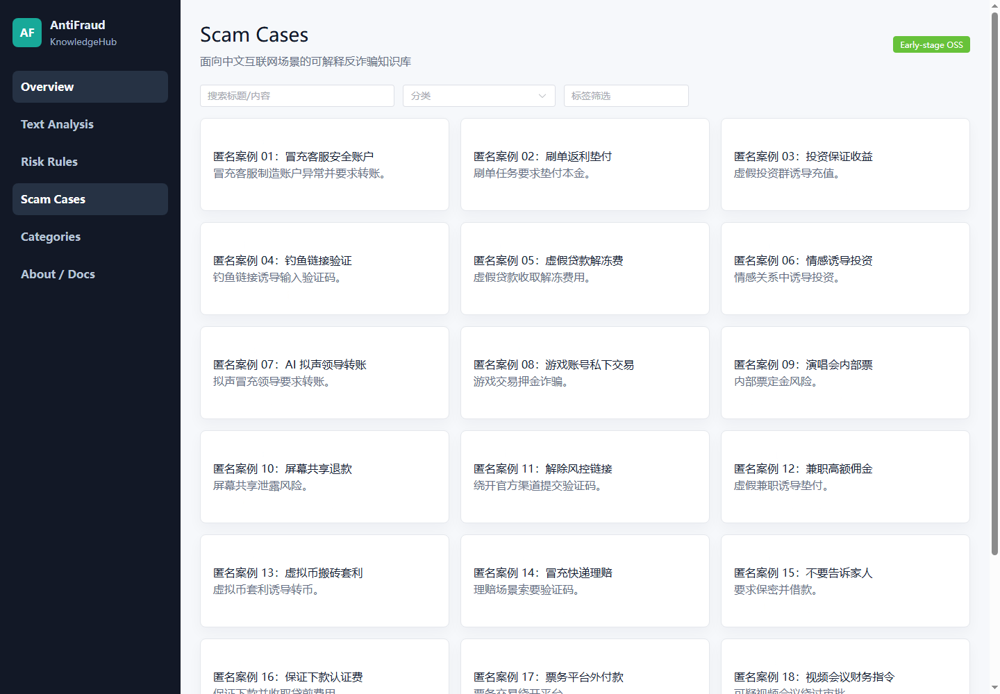

# Screenshots

These screenshots were captured from the local MVP running the Go API and Vue3
dashboard against anonymized seed/demo data. They are intended for README and
issue #2 documentation validation.

## Dashboard Overview

## Text Risk Analysis

## Risk Rules

## Scam Cases

